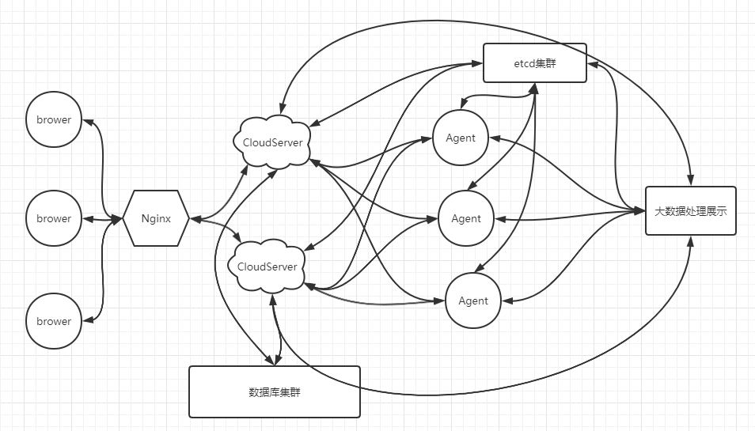

## `CloudShield`（云盾）

> `CloudShield`即云盾，是一款开源的服务器自动化运维安全管理的系统。

#### `CloudShield` 的目标

> 相信大家在工作中都会遇到这样一个问题，一个公司内各式各样的系统非常多，各个部门重复造轮子的情况非常普遍。一方面是为了KPI，另一方面是因为我觉得你写的跟我的需求有点不一样或者我觉得你写的效率不高，然后再写一个类似的，日积月累，轮子堆积如山。这样不仅增加了新人上手的难度，而且对后期的开发维护也极其不友好。

> `CloudShield`希望通过提供一个稳定可靠的框架来解决这个问题。

#### `CloudShield` 的功能

> 一句话概括，`CloudShield`是无所不能的

> 确的说，`CloudShield`有多强大取决于你，下面看一下框架提供的功能

#### 整体架构图

#### 各模块说明

- **CloudServer** : 云盾的控制管理平台，既可以远程控制Agent的运行，也可以查看大数据处理展示的结果。建议使用 [`jumpserver`](https://github.com/jumpserver/jumpserver) 进行二次开发来完成 `CloudServer` 模块。

- **Agent** : 云盾的核心模块，安装在各个服务器上，主要提供一个稳定可控的框架，方便运维和业务部门进行管理。

- **大数据处理展示** : 通过收集各个Agent传来的数据进行挖掘分析并展示。

- **etcd集群** : 负责服务的注册和发现，方便动态的扩容，具有高可用性。

- **数据库集群** : 可使用redis、MySQL、MongoDB来存储数据。

#### 重要问题QA

> `Q:` 为什么只提供Agent部分代码？   

> `A:` 因为各个公司的需求不一样，各个业务需要挖掘分析的数据也不同，CloudShield的目的不是做一个傻瓜式的开箱即用的系统，而是提供一个稳定高效的框架。大家可以在此基础上自由发挥，方便的扩展各种需求。

> `Q:` Agent为什么用C语言而不是其他语言？

> `A:` Agent的语言选型基于几个方面，第一要素是稳定，不能因为GC的波动影响业务，第二要素是CPU和内存的消耗尽量低，第三要素是计算高效。总的来说，框架的代码量并不大，不用为了快速开发而舍弃一些重要的东西。

> `Q:` Agent除了在自动化方面发挥作用，在安全方面作用如何？

> `A:` Agent在服务器安全方面做了很多工作，不仅可以实时监控服务器的安全，而且还可以对即将到来的攻击进行预警，并且通过ptrace附加来限制程序的功能来避免审核出现问题的意外。

> `Q:` Agent对网络协议栈的处理为什么用libpcap而不是netfilter？

> `A:` libpcap运行在网卡和协议栈交互的过程，可以捕获被iptables规则过滤掉的数据包，有助于分析进出流量的异常情况。

> 欢迎大家使用`CloudShield`，`CloudShield`是免费开源的，需要技术支持或想要给`CloudShield`贡献代码请发送邮件到：250425650@qq.com
